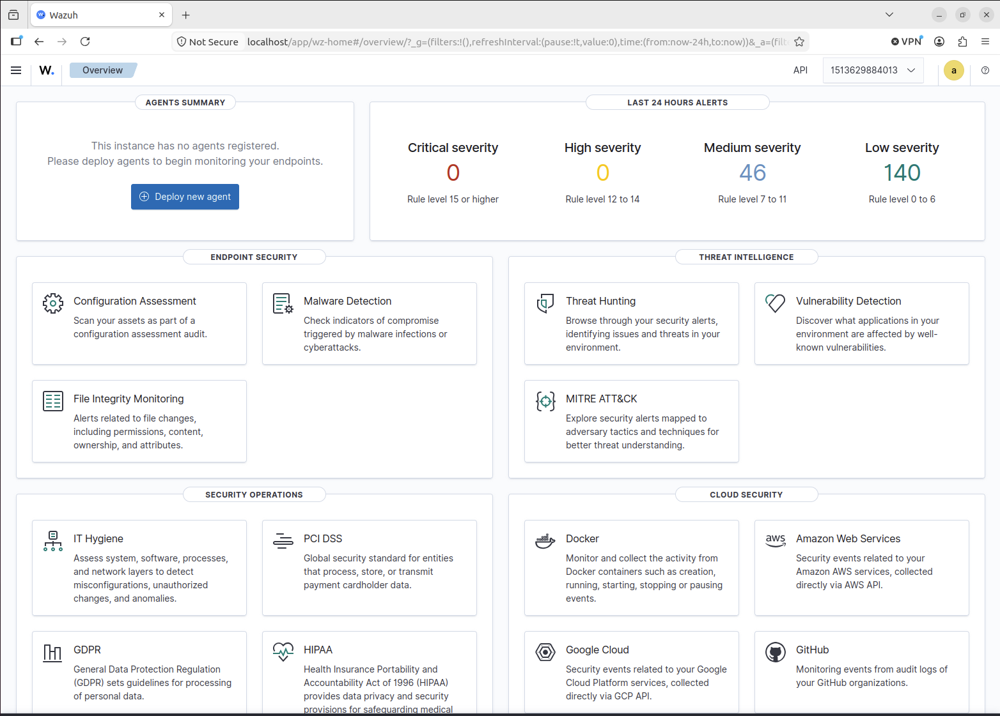

# Home-SOC-Lab
Building a home SOC lab to develop practical skills in detection engineering, threat hunting, incident response, SIEM and security automation.
## Wazuh SIEM Deployment

Set up Wazuh on an Ubuntu ARM64 VM running through UTM on my MacBook. Wazuh is running as a single-node deployment using Docker.

During the initial setup, I expanded the VM storage and configured the required system settings before getting the Wazuh manager, indexer and dashboard running successfully.

## Endpoint Monitoring

Deployed the Wazuh agent to a separate Ubuntu 24.04 LTS VM to act as a monitored endpoint.

The endpoint successfully enrolled with the Wazuh manager and began reporting security events, system inventory, vulnerability data and security configuration assessment results.

