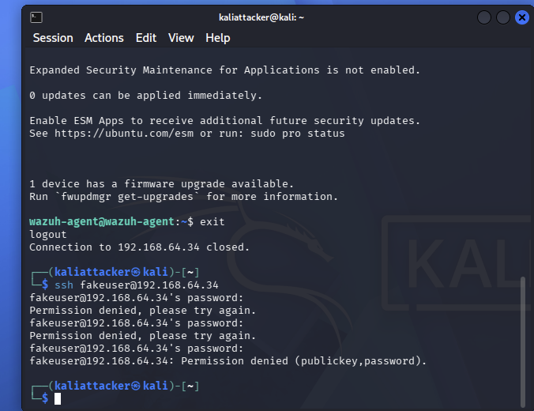
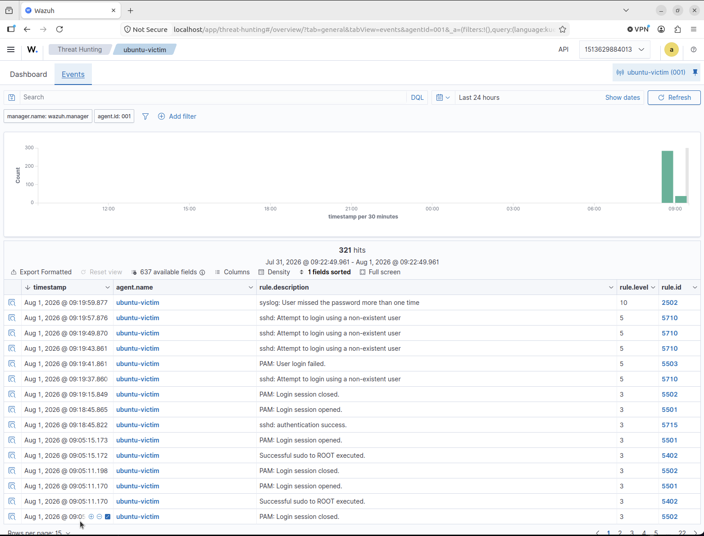

# Home-SOC-Lab
Building a home SOC lab to develop practical skills in detection engineering, threat hunting, incident response, SIEM and security automation.
## Wazuh SIEM Deployment

Set up Wazuh on an Ubuntu ARM64 VM running through UTM on my MacBook. Wazuh is running as a single-node deployment using Docker.

During the initial setup, I expanded the VM storage and configured the required system settings before getting the Wazuh manager, indexer and dashboard running successfully.

## Endpoint Monitoring

Deployed the Wazuh agent to a separate Ubuntu 24.04 LTS VM to act as a monitored endpoint.

The endpoint successfully enrolled with the Wazuh manager and began reporting security events, system inventory, vulnerability data and security configuration assessment results.

## SSH Attack Simulation

After confirming that the Wazuh agent was successfully reporting to the SIEM, I performed a controlled SSH authentication attack from a Kali Linux VM against the monitored Ubuntu endpoint.

The test consisted of repeated SSH login attempts using a non-existent user. This was designed to generate authentication failures and verify that SSH security events were being collected from the endpoint and forwarded to Wazuh for analysis.

Wazuh successfully detected the authentication activity. The failed attempts generated multiple `sshd` alerts, including rule `5710` for attempts to authenticate using a non-existent user.

The events also captured useful investigation data including the source IP address, attempted username, timestamp and authentication result. This confirmed that the SIEM had sufficient visibility to identify and investigate SSH authentication attacks.

